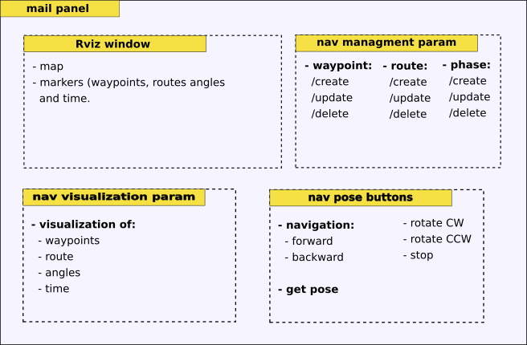
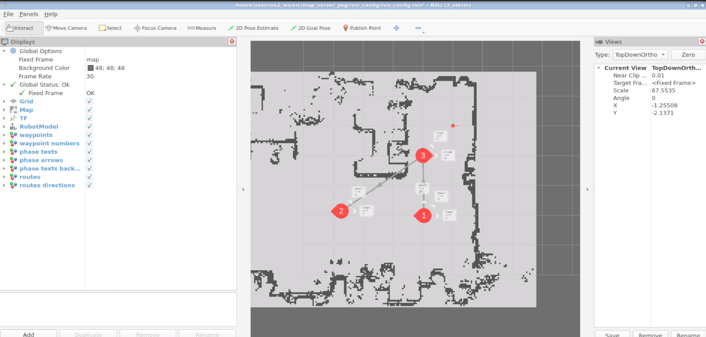
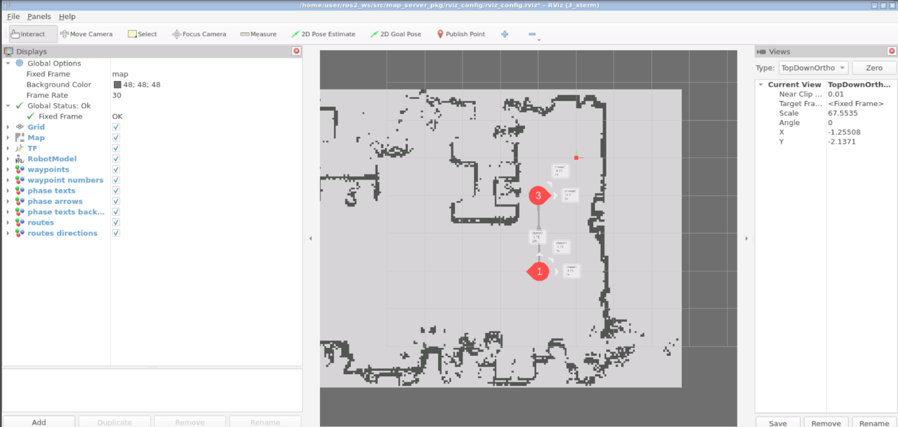
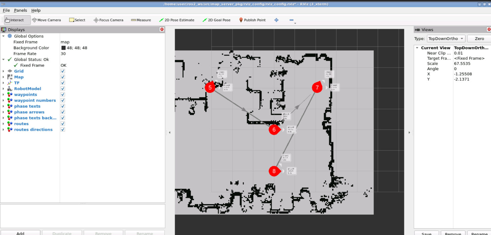

## Web interface for Autonomous Mobile Robot Applications
### Table of contents

 - [1. Overview](#1-overview)
 - [2. Web interface](#2-web-interface)
     - [2.1 Main panel](#21-main-panel)
         - [2.1.1 RViz window](#211-rviz-window)
           - [Map](#map)
           - [Markers](#markers)            
       - [2.1.2 Management of navigation parameters](#212-management-of-navigation-parameters)   
       - [2.1.3 Visualization of navigation parameters](#213-visualization-of-navigation-parameters)  
       - [2.1.4 Navigation buttons](#214-navigation-buttons)  
 - [3. Service servers](#3-service-servers)
   - [3.1 Add point server](#31-add-point-server)
   - [3.2 Update point server](#32-update-point-server)
   - [3.3 Delete point server](#33-delete-point-server)
   - [3.4 Add route server](#34-add-route-server)
   - [3.5 Update route server](#35-update-route-server)
   - [3.6 Delete route server](#36-delete-route-server)
   - [3.7 Add routine server](#37-add-routine-server)
   - [3.8 Update routine server](#38-update-routine-server)
   - [3.9 Delete routine server](#39-delete-routine-server)    
   - [3.10 Add phase server](#310-add-phase-server)
   - [3.11 Update phase server](#311-update-phase-server)
   - [3.12 Delete phase server](#312-delete-phase-server)       
 - [4. Work flow](#4-work-flow)


### 1. Overview
Building a web interface to manage the activity of a robot in a room. The management is made possible through the interactions with a few service servers that read and write data on an yaml archive file. This first release involves only one room.

### 2. Web interface
At this moment of development, the web interface contains only one panel: the main panel.

#### 2.1 Main panel
The main panel contains four areas:

1. Rviz window;
2. management of navigation parameters;
3. visualization of navigation parameters;
4. Navigation buttons.



                 Figure 1.: structure of the main panel


[Go to top](#web-interface-for-autonomous-mobile-robot-applications)

#### 2.1.1 RViz window
The Rviz window displays the room map where some markers highlight waypoints. A dashed line connects waypoints to show a possible route.
    
#### Map
The map of the room.
#### Markers
The markers highlight waypoints with colorful points and route with dashed line.

#### 2.1.2 Management of navigation parameters
It allows the management of waypoint, routes and phases. For waypoint, route and phase it is possible creating, updating and deleting a waypoint, route and phase.

#### 2.1.3 Visualization of navigation parameters
It allows the visualization of waypoint, routes and phases. 

#### 2.1.4 Navigation buttons
The navigation buttons allow to move the robot to the desidered pose:

- forward;
- backward;
- rotate CW;
- rotate CCW.

Another button allows to get the pose.

[Go to top](#web-interface-for-autonomous-mobile-robot-applications)

### 3. Service servers

#### 3.1 Add point server

The /add_point_server creates a waypoint. It is possible reaching and sampling a pose using the nav buttons.

#### 3.2 Update point server

This server will be available in the next releases. The /update_point_server updates the coordinates of a selected waypoint.

#### 3.3 Delete point server

The /delete_point_server deletes a selected waypoint.

#### 3.4 Add route server

The /add_route_server creates a route with at least two waypoints.

#### 3.5 Update route server

This server will be available in the next releases. The /update_route_server updates a route. There are many possibilities for updating a selected route: changing the sequence of the waypoints, adding, deleting (if >2 ), updating a waipoints, all together.

#### 3.6 Delete route server

The /delete_route_server deletes a route.

#### 3.7 Add routine server

The /add_routine_server creates a routine linked to a waypoint of a route. It needs to specify the rotation angle and the lighting time.

#### 3.8 Update routine server 

This server will be available in the next releases. The /update_routine_server updates a routine linked to a waypoint of a route. It changes the rotation angle and the lighting time. 

#### 3.9 Delete routine server

The /delete_routine_server delete a routine linked to a waypoint of a route.

#### 3.10 Add phase server

The /add_phase_server creates a phase linked to a routine of a route. It needs to specify the rotation angle and the lighting time.

#### 3.11 Update phase server

This server will be available in the next releases. The /update_phase_server updates a phase linked to a routine of a route. It changes the rotation angle and the lighting time.

#### 3.12 Delete phase server

The /delete_phase_server delete a phase linked to a routine of a route.

[Go to top](#web-interface-for-autonomous-mobile-robot-applications)

### 4. Work flow​

 - ##### first goal: nav parameters visualization on a map
   - create yaml file (just available)
   - create a server that read the yaml file (done: test version)
   - extract the waypoints and their coordinates (done: test version)
   - load a office map on RViz (done)
      
   - visualize markers reading from a navigation yaml file (done)
   

Launch rviz2 to visualize map and markers and load the configuration in rviz_config folder of map_server_pkg package.

```
rviz2

```

Visualize the fake_robot

```
ros2 launch frame_description urdf_visualize.launch.py

```

  Launch the map server
```
ros2 launch map_server_pkg nav2_map_server.launch.py

```   
  to Visualize routes of the office_points.yaml file, launch the server and the client below.
  
```
ros2 launch rooms_pkg navroutes_visualization_server.launch.py

```

```
ros2 launch rooms_pkg navroutes_visualization_client.launch.py

```

Result on rviz

  

                 Figure 2.: route_id = 0 visualized on the map

  

                 Figure 3.: route_id = 1 visualized on the map

  

                 Figure 3.: route_id = 2 visualized on the map

[Go to top](#web-interface-for-autonomous-mobile-robot-applications)

## Getting started

To make it easy for you to get started with GitLab, here's a list of recommended next steps.

Already a pro? Just edit this README.md and make it your own. Want to make it easy? [Use the template at the bottom](#editing-this-readme)!

## Add your files

- [ ] [Create](https://docs.gitlab.com/ee/user/project/repository/web_editor.html#create-a-file) or [upload](https://docs.gitlab.com/ee/user/project/repository/web_editor.html#upload-a-file) files
- [ ] [Add files using the command line](https://docs.gitlab.com/ee/gitlab-basics/add-file.html#add-a-file-using-the-command-line) or push an existing Git repository with the following command:

```
cd existing_repo
git remote add origin https://gitlab.com/Salvatore_Volpe/web-interface-for-autonomous-mobile-robot-applications.git
git branch -M main
git push -uf origin main
```

## Integrate with your tools

- [ ] [Set up project integrations](https://gitlab.com/Salvatore_Volpe/web-interface-for-autonomous-mobile-robot-applications/-/settings/integrations)

## Collaborate with your team

- [ ] [Invite team members and collaborators](https://docs.gitlab.com/ee/user/project/members/)
- [ ] [Create a new merge request](https://docs.gitlab.com/ee/user/project/merge_requests/creating_merge_requests.html)
- [ ] [Automatically close issues from merge requests](https://docs.gitlab.com/ee/user/project/issues/managing_issues.html#closing-issues-automatically)
- [ ] [Enable merge request approvals](https://docs.gitlab.com/ee/user/project/merge_requests/approvals/)
- [ ] [Automatically merge when pipeline succeeds](https://docs.gitlab.com/ee/user/project/merge_requests/merge_when_pipeline_succeeds.html)

## Test and Deploy

Use the built-in continuous integration in GitLab.

- [ ] [Get started with GitLab CI/CD](https://docs.gitlab.com/ee/ci/quick_start/index.html)
- [ ] [Analyze your code for known vulnerabilities with Static Application Security Testing(SAST)](https://docs.gitlab.com/ee/user/application_security/sast/)
- [ ] [Deploy to Kubernetes, Amazon EC2, or Amazon ECS using Auto Deploy](https://docs.gitlab.com/ee/topics/autodevops/requirements.html)
- [ ] [Use pull-based deployments for improved Kubernetes management](https://docs.gitlab.com/ee/user/clusters/agent/)
- [ ] [Set up protected environments](https://docs.gitlab.com/ee/ci/environments/protected_environments.html)

***

# Editing this README

When you're ready to make this README your own, just edit this file and use the handy template below (or feel free to structure it however you want - this is just a starting point!). Thank you to [makeareadme.com](https://www.makeareadme.com/) for this template.

## Suggestions for a good README
Every project is different, so consider which of these sections apply to yours. The sections used in the template are suggestions for most open source projects. Also keep in mind that while a README can be too long and detailed, too long is better than too short. If you think your README is too long, consider utilizing another form of documentation rather than cutting out information.

## Name
Choose a self-explaining name for your project.

## Description
Let people know what your project can do specifically. Provide context and add a link to any reference visitors might be unfamiliar with. A list of Features or a Background subsection can also be added here. If there are alternatives to your project, this is a good place to list differentiating factors.

## Badges
On some READMEs, you may see small images that convey metadata, such as whether or not all the tests are passing for the project. You can use Shields to add some to your README. Many services also have instructions for adding a badge.

## Visuals
Depending on what you are making, it can be a good idea to include screenshots or even a video (you'll frequently see GIFs rather than actual videos). Tools like ttygif can help, but check out Asciinema for a more sophisticated method.

## Installation
Within a particular ecosystem, there may be a common way of installing things, such as using Yarn, NuGet, or Homebrew. However, consider the possibility that whoever is reading your README is a novice and would like more guidance. Listing specific steps helps remove ambiguity and gets people to using your project as quickly as possible. If it only runs in a specific context like a particular programming language version or operating system or has dependencies that have to be installed manually, also add a Requirements subsection.

## Usage
Use examples liberally, and show the expected output if you can. It's helpful to have inline the smallest example of usage that you can demonstrate, while providing links to more sophisticated examples if they are too long to reasonably include in the README.

## Support
Tell people where they can go to for help. It can be any combination of an issue tracker, a chat room, an email address, etc.

## Roadmap
If you have ideas for releases in the future, it is a good idea to list them in the README.

## Contributing
State if you are open to contributions and what your requirements are for accepting them.

For people who want to make changes to your project, it's helpful to have some documentation on how to get started. Perhaps there is a script that they should run or some environment variables that they need to set. Make these steps explicit. These instructions could also be useful to your future self.

You can also document commands to lint the code or run tests. These steps help to ensure high code quality and reduce the likelihood that the changes inadvertently break something. Having instructions for running tests is especially helpful if it requires external setup, such as starting a Selenium server for testing in a browser.

## Authors and acknowledgment
Show your appreciation to those who have contributed to the project.

## License
For open source projects, say how it is licensed.

## Project status
If you have run out of energy or time for your project, put a note at the top of the README saying that development has slowed down or stopped completely. Someone may choose to fork your project or volunteer to step in as a maintainer or owner, allowing your project to keep going. You can also make an explicit request for maintainers.
