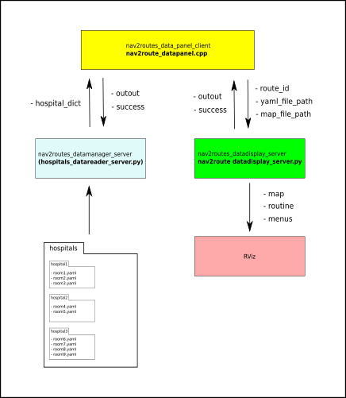
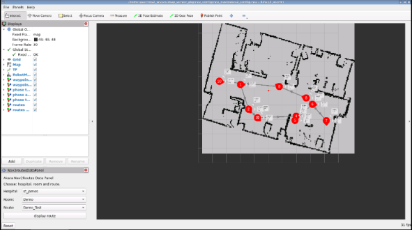
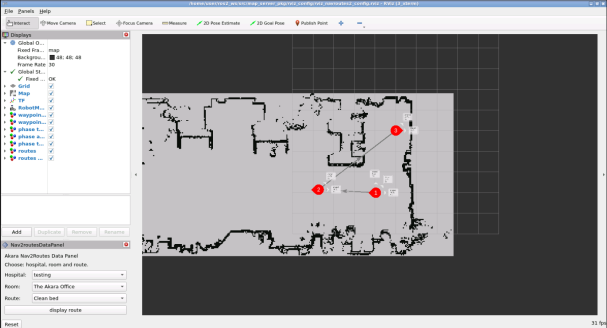
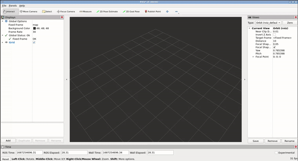

## RViz2 Panel for Autonomous Mobile Robot Applications
### Table of contents

 - [1. Overview](#1.-Overview)

 - [2. RViz interface](#2.-RViz-interface)

     - [2.1 Main panel](#2.1-Main-panel)

         - [2.1.1 RViz2 window](#2.1.1-RViz2-window)

           - [Nav2route datamanager](#Nav2route-datamanager)

           - [Nav2route datapanel](#Nav2route-datapanel) 
           
           - [Nav2route datadisplay](#Nav2route-datadisplay) 
           
       - [2.1.2 Management of navigation parameters](#2.1.2-Management-of-navigation-parameters)   
       - [2.1.3 Visualization of navigation parameters](#2.1.3-Visualization-of-navigation-parameters)  
       - [2.1.4 Navigation buttons](#2.1.4-Navigation-buttons)  

 - [3. Service servers](#3.-Service-servers)

   - [3.1 Add point server](#3.1-Add-point-server)
   - [3.2 Update point server](#3.2-Update-point-server)
   - [3.3 Delete point server](#3.3-Delete-point-server)
   - [3.4 Add route server](#3.4-Add-route-server)
   - [3.5 Update route server](#3.5-Update-route-server)
   - [3.6 Delete route server](#3.6-Delete-route-server)
   - [3.7 Add phase server](#3.7-Add-phase-server)
   - [3.8 Update phase server](#3.8-Update-phase-server)
   - [3.9 Delete phase server](#3.9-Delete-phase-server)

     
  
 - [4. Installation](#4.-Installation)
 - [5. Usage](#5.-Usage)


### 1. Overview
This project refers to an autonomous mobile robot used to disinfect hospital rooms. In particular, it mainly allows you to display routes, waypoints and other operational data. Of course, there are many paths in one room and several rooms in every hospital. Therefore, to manage the choice of a route, a panel has been created for RViz2 with drop-down menus that allow you to select the desired route. The main packages that manages these data are mainly:

- nav2routes_datamanager;
- nav2routes_datadisplay;
- nav2routes_datapanel.

The first creates the dictionary of the hospitals data, the second is in charge of display the waypoints, route and routines and the last to handle the selection of the route.


figure 1: Akara Autonomous Mobile Robot during the disinfection of a CT room.

### 2. RViz interface
At this moment of development, the RViz2 interface contains only one panel: the main panel. At the state of the art, only the point 3 of the list below has been developed.

#### 2.1 Main panel
The main panel contains four areas:

1. RViz2 window;
2. management of navigation parameters;
3. visualization of navigation parameters;
4. Navigation buttons.


            


Figure 2.: structure of the main panel

[Go to top](#RViz2-Panel-for-Autonomous-Mobile-Robot-Applications)

### 2.1.1 RViz2 window
The RViz2 window displays the room map where some markers highlight waypoints. A line connects waypoints to show a possible route. Some arrows indicate the direction of movement. The sistem works thank to servers and clients as shown in figure 3.

#### Nav2route datamanager
This server is able reading the structure **site_data** folder and builds a dictionary containing all the hospitals data.

#### Nav2route datapanel
This Rviz panel incorporates several functions:
- call **hospitals_datareader_server** and receive the hospitals dictionary through a client;
- populates the drop-down menus with the dictionary extract data;
- collect the information through a drop-down menus as: map, hospital, room and route;
- call map_server to update the map;
- call **nav2routes_datadisplay_server** sending data to display route and routine with each phases.

#### Nav2route datadisplay
This server provides to display as Markers Array: route, routine and phases reading in to a name_point.yaml file that contains room data sampling. 




Figure 3.: project's structure client - servers

#### 2.1.2 Management of navigation parameters
It allows the management of waypoint, routes and phases. For waypoint, route and phase it is possible creating, updating and deleting a waypoint, route and phase.

#### 2.1.3 Visualization of navigation parameters
It allows the visualization of waypoint, routes and phases. 

#### 2.1.4 Navigation buttons
The navigation buttons allow to move the robot to the desidered pose:

- forward;
- backward;
- rotate CW;
- rotate CCW.

Another button allows to get the pose.

[Go to top](#RViz2-Panel-for-Autonomous-Mobile-Robot-Applications)

### 3. Service servers

#### 3.1 Add point server
The /add_point_server creates a waypoint. It is possible reaching and sampling a pose using the nav buttons.
#### 3.2 Update point server
The /update_point_server updates the coordinates of a selected waypoint.
#### 3.3 Delete point server
The /delete_point_server deletes a selected waypoint.
#### 3.4 Add route server
The /add_route_server creates a route with at least two waypoints.
#### 3.5 Update route server
The /update_route_server updates a route. There are many possibilities for updating a selected route: changing the sequence of the waypoints, adding, deleting (if >2 ), updating a waipoints, all together.
#### 3.6 Delete route server
The /delete_route_server deletes a route.
#### 3.7 Add phase server
The /add_phase_server creates a phase linked to a waypoint of a route. It needs to specify the rotation angle and the lighting time.
#### 3.8 Update phase server
The /update_phase_server updates a phase linked to a waypoint of a route. It changes the rotation angle and the lighting time.
#### 3.9 Delete phase server
The /delete_phase_server delete a phase linked to a waypoint of a route.

[Go to top](#RViz2-Panel-for-Autonomous-Mobile-Robot-Applications)

### 4. Installation

This guide assumes that ROS2 Humble has been already installed. 
Open a terminal and type


```python
cd ~/ros2_ws/src
git clone https://github.com/motomechatronics/Rviz2_panel_for_Autonomous_Mobile_Robot_Applications.git
cd ..
colcon build
source /opt/ros/humble/setup.bash
```

If you not have the tf-transformations installed, type


```python
sudo pip3 install transforms3d
sudo apt install ros-humble-tf-transformations
```

### 5. Usage

Open a terminal and launch the server that builds the hospitals dictionary reading in the site_data folder.


```python
ros2 launch nav2routes_datamanager hospitals_datareader_server.launch.py
```

Open a new terminal and Visualize the fake_robot, typing


```python
ros2 launch frame_description urdf_visualize.launch.py
```

In another terminal, launch the map server


```python
ros2 launch map_server_pkg nav2_map_server.launch.py
```

To visualize the robot poses, routes and routines contained into the yaml files, open another terminal and type


```python
ros2 launch nav2routes_datadisplay nav2routes_datadisplay_server.launch.py
```

Open another terminal and launch rviz2 to visualize map and markers and load its configuration in **rviz_nav2routes_config** folder in map_server_pkg.


```python
rviz2
```

Use the drop-dowm menus to select the hospital, the room and the route. Note that when you select hospital and room, the panel updates the map and shows automatically the first route. If you want to display the others, you have to select it and press **display route**, as shown in figure 5.



                


```python

```

Figure 3.: pose waypoints, route and routines displayed on the map

Use the drop-down menus to navigate and select hospitals, rooms and route among the lists. Press **display route** to visualize the waypoints with the owm routine and the route followed. Some result are shown in figure 2 and 3.



Figure 4.: pose waypoints, route and routines displayed on the map




Figure 5.: nav2routes_datapanel usage

[Go to top](#RViz2-Panel-for-Autonomous-Mobile-Robot-Applications)
